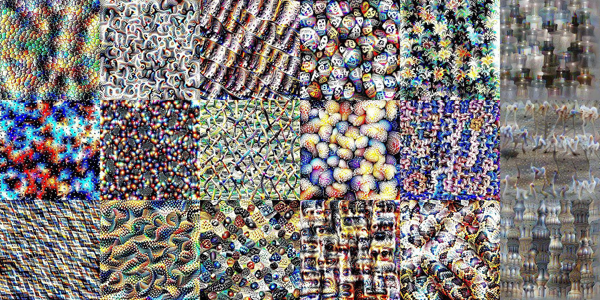

# Feature Visualization: Mini Lucid TF2 

This is a personal project to re-implement part of [Lucid](https://github.com/tensorflow/lucid) in TensorFlow 2. Lucid is a package for research in neural network interpretability, and is built on TensorFlow 1.

Specifically, this repository covers the content of [this article](https://distill.pub/2017/feature-visualization/) on feature visualization. The key idea is to visualize features learned in a component of a model by maximizing its activation in a generated image.

This approach of feature visualization consists of the following ingredients:

- **Objective function.**  A function to be maximized in an image, representing what feature to visualize.
- **Image parametrization.** A choice of how to represent the degrees of freedom in an image, which can impact the optimization result.
- **Transformations.** Small perturbations of the image applied throughout optimization, in order to arrive at a more robust result.

[<u>Note</u>. The collage at the top is a sample of visualizations of [Inception V3](https://arxiv.org/abs/1512.00567) (pre-trained on ImageNet) created using this repository. Each image in the *k*-th column comes from a channel in layer 'mixed*k*'.]

## Notebooks

The following notebooks illustrates some applications of this repository:

- [Demo](https://colab.research.google.com/github/pokman/mini_lucid_tf2/blob/main/feature_viz_demo.ipynb)
- [Diversity of Features](https://colab.research.google.com/github/pokman/mini_lucid_tf2/blob/main/feature_viz_diversity.ipynb)
- [Regularization](https://colab.research.google.com/github/pokman/mini_lucid_tf2/blob/main/feature_viz_regularization.ipynb)

## Comparison with Lucid

This project only aims to cover the functionalities of [Lucid](https://github.com/tensorflow/lucid) discussed in [this article](https://distill.pub/2017/feature-visualization/) on feature visualization. Within this scope, the main difference is our **use of TensorFlow 2** instead of 1. In particular:

- The code is written and structured in [eager mode](https://www.tensorflow.org/guide/eager).
- Optimization relies on a [gradient tape](https://www.tensorflow.org/guide/autodiff).
- In view of the abundance of publicly available pre-trained models (e.g. via [Keras Applications](https://www.tensorflow.org/api_docs/python/tf/keras/applications)), no model zoo is included.

There are also a few minor, technical differences:

- A subclass of objectives is created for those depending only on a layer of a model. Combining multiple objectives associated to the same layer can be done without repeatedly referring to that layer or the underlying model, and invokes only a single evaluation of the layer.
- Only parametrizations in frequency (Fourier) space are considered. The standard parametrization in pixel space should be equivalent to one in frequency space with frequency decay rate set to zero.
- The translation from frequency space parameters to pixels is slightly modified so that the entire calculation is reversible (or, in math lingo, bijective).
- A tensor-native rotation function is implemented 'from scratch', as the one used in Lucid has been deprecated in TensorFlow 2 and the only off-the-shelf option seems to be in [TensorFlow Addons](https://www.tensorflow.org/addons/api_docs/python/tfa/image/rotate), whose dependency we want to avoid.

